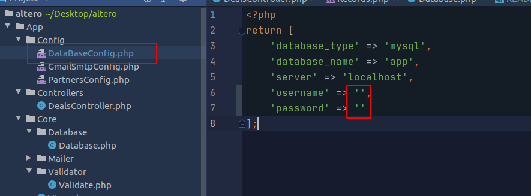

# Altero

This project has two input fields - email and amount. 
When submitted,  input data is being processed and stored in the applications table.  A confirmation mail is sent to the customer. All current requests can be seen when "show records" are pressed.
When change status is pressed, a deal state is changed from "ask" to "offer" and email is sent to partner depending
on the amount customers choose.

Please follow instructions below.

    Firs copy project adress like this:

    Then open terminal within a folder, were you want to download file.
    Enter command "git clone" and paste address you copied above in terminal.

    Install Composer Dependencies.
    "composer install"

    Make mariaDB database called "app" with two tables - "applications" and "deals". Create rows as shown in example.

    Enter your database credentials here: 

    Start server with command "PHP -S localhost:8000" from project folder.

    Preview of project:
    

    

